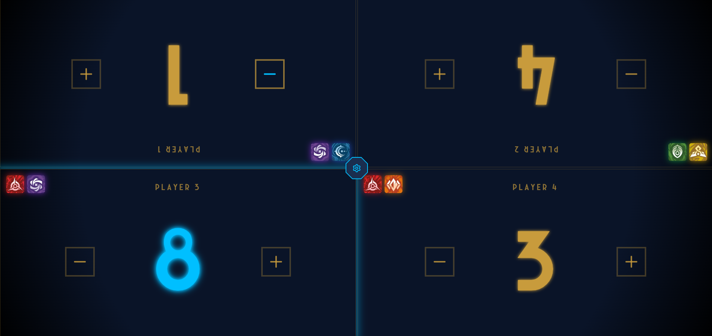
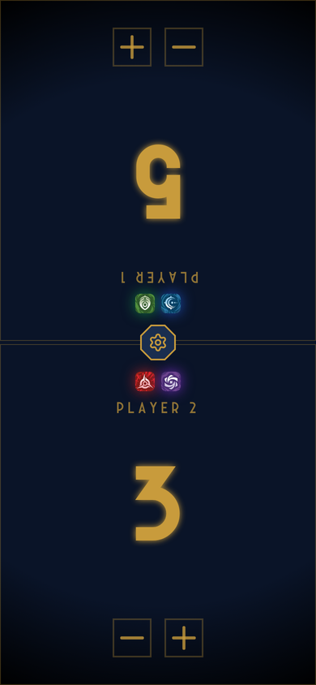
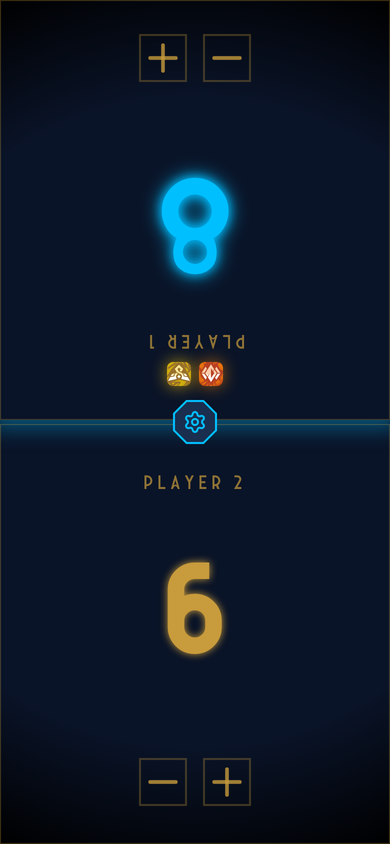
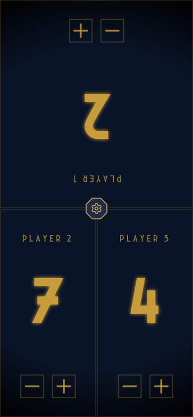

# Runic Counter

**A victory-score tracker for the Riftbound trading card game, built for the table: one phone or tablet in the middle, every player reads their own score.**

[](https://merlinsleeps.github.io/runic-counter/)




---

## About

In Riftbound, players race to a victory score: **8 points** in a standard game, **11 points** in 2v2. Pen and paper or dice get messy fast, and generic counter apps don't fit how a TCG table works. Players sit on different sides and need to read their own number, and you want to see each player's domains at a glance.

Runic Counter is my answer to that: a single-screen app you put in the middle of the table. It installs as a PWA, works offline and keeps the game state if the phone locks or the browser reloads.

**My role:** solo project, from concept, UX and visual design through implementation and deployment.

## Features

- **1 to 4 players.** The layout adapts to the player count. Panels facing players on the opposite side of the table are rotated 180°, so everyone reads their score the right way up.
- **Portrait and landscape layouts** tuned for phones and tablets. In landscape the score sits between the +/− buttons for a wider grip.
- **Game modes:** Standard (first to 8) and 2v2 (teams, first to 11). Scores are capped at the target.
- **Victory state:** when a player reaches the target, their score and panel switch from gold to a glowing Hextech blue, and so does the central settings button.
- **Domain display:** tap a player's name to choose up to two of the six domains (Fury, Calm, Mind, Body, Chaos, Order). They appear as glowing icons in that player's panel.
- **Animated score changes** with Framer Motion. The number slides up or down depending on the direction.
- **Persistent state:** scores, player count and game mode are stored in `localStorage` and survive reloads.
- **Installable PWA:** add it to the home screen and it runs fullscreen and offline (service worker via `vite-plugin-pwa`).

| 2 players | Victory | 3 players |
| :---: | :---: | :---: |
|  |  |  |

## Design decisions

- **Built for a shared device.** Every interaction is a single large tap target. There are no menus during play, only the octagonal settings button in the centre, which sits on the line between players so nobody "owns" it.
- **Readability over decoration.** The score is the largest element on screen and uses a display font with a soft glow, so it can be read from across the table. Secondary information (player label, domains) is smaller and dimmed.
- **Colour carries meaning.** Gold means "in play", blue means "won". The domain icons use the official colour coding players already know from the cards.
- **Visual identity** inspired by the Arcane/Hextech look of Runeterra: dark navy background, gold accents and octagonal shapes.

## Tech stack

| Area | Technology |
| --- | --- |
| UI | React 19, TypeScript |
| Styling | Tailwind CSS 3 with a custom theme (domain colours, glow effects), custom fonts |
| Animation | Framer Motion |
| Icons | Lucide React, domain icons |
| Build | Vite 7 |
| Offline / install | vite-plugin-pwa (Workbox service worker, web manifest) |
| Native (in progress) | Capacitor 7 (Android) |
| CI/CD | GitHub Actions: build and deploy to GitHub Pages on every push to `main` |

## Getting started

```bash
git clone https://github.com/MerlinSleeps/runic-counter.git
cd runic-counter
npm install
npm run dev        # development server
npm run build      # type-check and production build into dist/
npm run preview    # serve the production build locally (PWA included)
```

The app is served under the `/runic-counter/` base path (see `vite.config.ts`) to match GitHub Pages.

## Roadmap

- [ ] Android release via Capacitor
- [ ] Remember each player's domains across reloads
- [ ] Optional player names
- [ ] Undo for accidental taps
- [ ] Split the main component into smaller components and add unit tests for the scoring logic

## Privacy

Runic Counter collects no personal data. Game state is stored only on your device. See the [privacy policy](https://merlinsleeps.github.io/runic-counter/privacy.html).

## Legal

Runic Counter is an unofficial fan project and is not endorsed by Riot Games. Riftbound, Runeterra and all associated properties are trademarks or registered trademarks of Riot Games, Inc.

## Related

[**Runic Library**](https://github.com/MerlinSleeps/runic-library): my deck builder and card database for Riftbound, built with Next.js, PostgreSQL and Firebase Auth ([live](https://runiclibrary.com/)).

---

Built by **Merlin** · [GitHub](https://github.com/MerlinSleeps)
